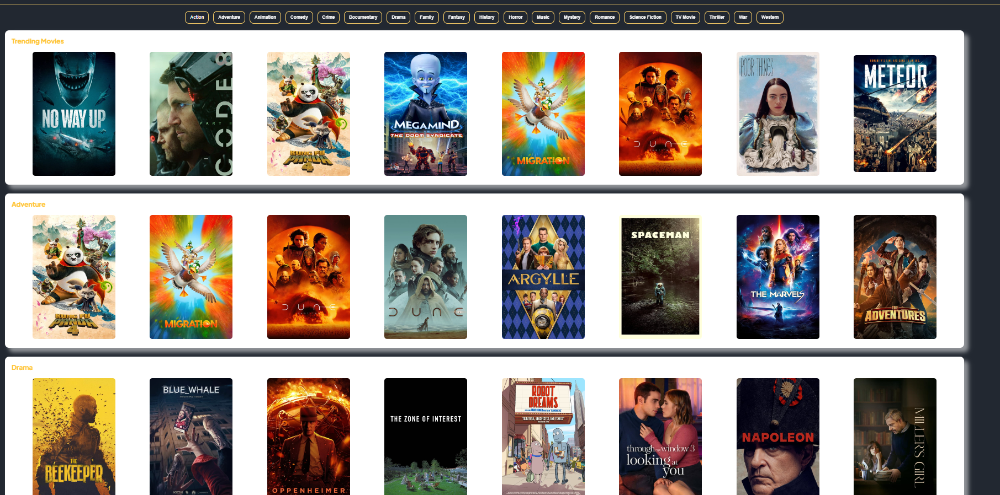

# Movies Application

## Intro

This project is made by two parts: the UI and the [API](https://github.com/thomasmelchers/movies_app_api).
This repo is dedicated to UI which has been build with React 18 and Typescript. It is a web application where each user can create an account and look for his/her favorite movies and tv-shows. All the data are comming from a thriparty API, TMDB API.
The UI holds several features such as login with access and refresh tokens, user profile, filters, search bar, paging, infinite scroll, youtube iframe, ...

## Features

-   Authentication with Access and Refresh Tokens
-   Persisting login
-   Protecting routes with roles
-   Displaying gender's products randomly (movies and tv-shows)
-   Displaying products with infinite scroll or paging
-   Filtering products by gender
-   Searching product by name and gender
-   Displaying product's trailer with an youtube iframe
-   Like and unlike products

-   Landing page
-   User profile
-   Movies & tv-shows page
-   Product detail page
-   Favorite page where all the liked products are displayed

## Technologies

-   React 18
-   Typescript
-   SASS
-   Material UI
-   axios
-   react-router-dom

## Future developments

-   Admin dashboard

## Deploiement

-   Vercel
